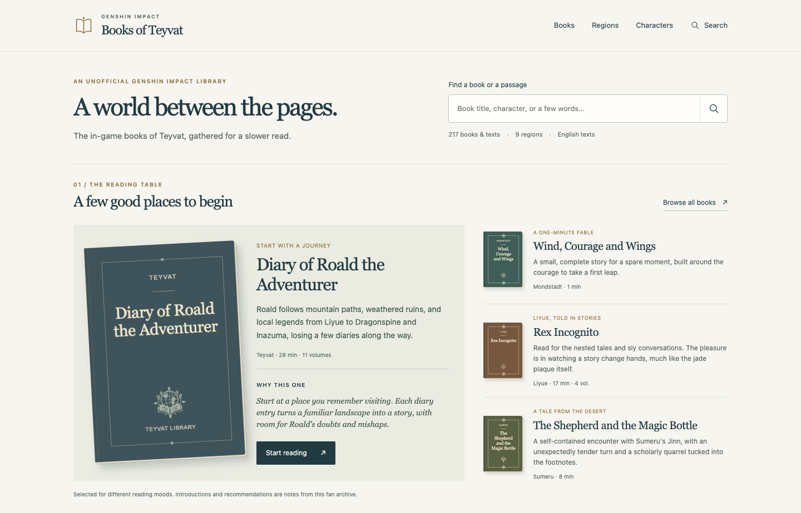

# sun98

## Genshin Impact Books

I maintain [Genshin Impact Books](https://genshinbooks.allsbai.com/), an independent fan reading room for the game's English book texts.

- Browse books and quest texts by region or search the library.
- Open a book and move between its volumes using the contents list.
- Adjust the text size and save your place in the same browser.

**A few places to start:** [The Fox in the Dandelion Sea](https://genshinbooks.allsbai.com/books/mondstadt/the-fox-in-the-dandelion-sea) · [Rex Incognito](https://genshinbooks.allsbai.com/books/liyue/rex-incognito) · [Toki Alley Tales](https://genshinbooks.allsbai.com/books/inazuma/toki-alley-tales)

The primary source is the English [HoYoWiki](https://wiki.hoyolab.com/pc/genshin/aggregate/book). Each reading identifies its source, including any retained earlier text variants. Genshin Impact text and artwork belong to HoYoverse; this fan project is not affiliated with or endorsed by HoYoverse.
